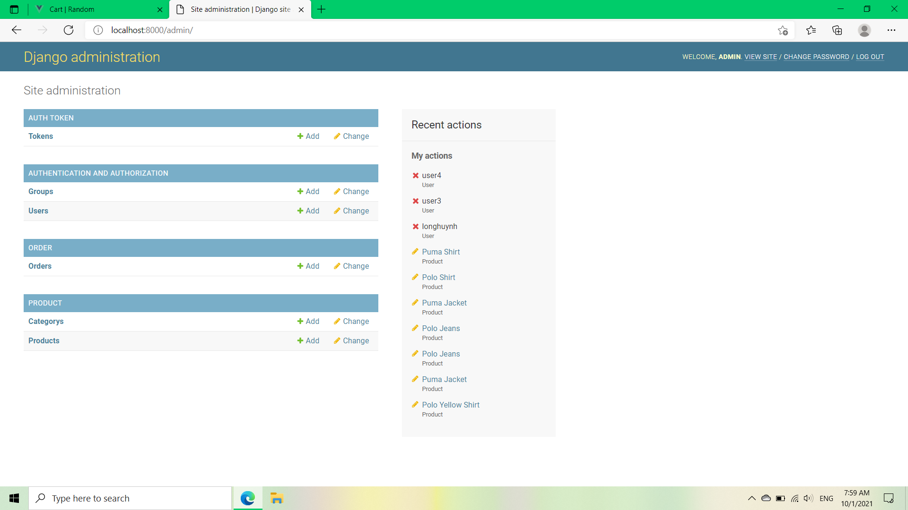

# Django Ecommerce
This project is a part of https://github.com/VThuan5421/vue_ecommerce.git

Prerequisites
> You need to Open command line and type below

Examples
1. cd ./path/to/django_ecommerce
2. python -m venv env or py -m venv env (create virtual environment)
3. .\env\Scripts\activate (run env)
4. pip install -r requirements.txt -v

Start project
> python manage.py runserver

